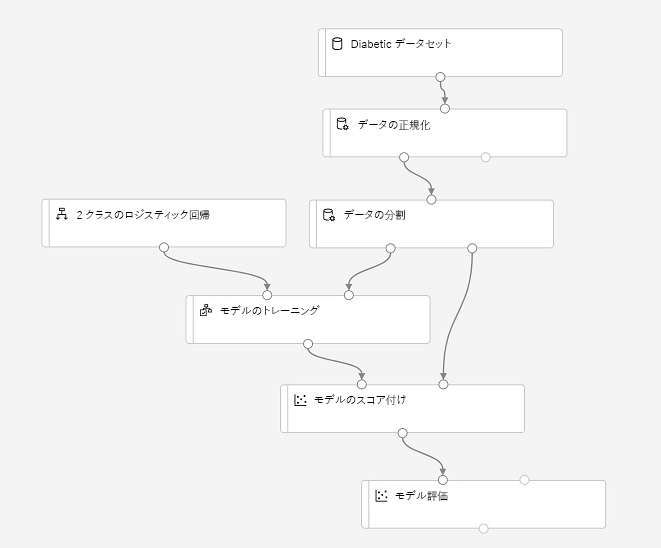
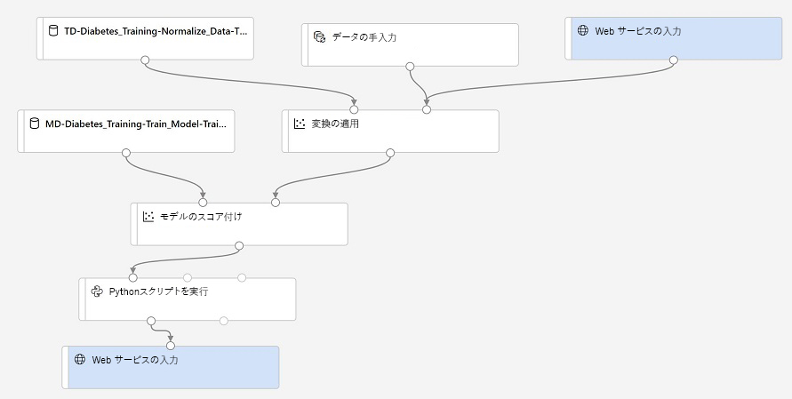

---
lab:
    title: 'Azure Machine Learning デザイナーを使用する'
---
# Azure Machine Learning デザイナーを使用する

Azure Machine Learning *デザイナー*は、ワークフロー、またはデータ インジェスト、変換、モデル トレーニング モジュールの*パイプライン*を定義して、機械学習モデルを作成できるドラッグ アンド ドロップ環境を提供します。その後、このパイプラインを、クライアント アプリケーションが*推論* (新しいデータから予測を生成する) に使用できる Web サービスとして公開できます。

## 開始前の準備

まだ行っていない場合は、*[Azure Machine Learning Workspace を作成する](01-create-a-workspace.md)* の演習を完了して、Azure Machine Learning ワークスペースとコンピューティング インスタンスを作成し、この演習に必要なノートブックのクローンを作成してください。

## コンピューティング リソースを構成する

Azure Machine Learning デザイナーを使用するには、モデル トレーニング実験を実行するための計算が必要です。

1. Azureサブスクリプションに関連付けられた Microsoft の資格情報を使用して [Azure Machine Learning Studio](https://ml.azure.com?azure-portal=true) にサインインし、Azure Machine Learning ワークスペースを選択します。
2. Azure Machine Learning Studio で、**コンピューティング** ページを表示し、まだ実行されていない場合は、**コンピューティング インスタンス** タブでコンピューティング インスタンスを開始します。このコンピューティング インスタンスを使用して、トレーニングされたモデルをテストします。
3. コンピューティング インスタンスの起動中に、**コンピューティング クラスター** タブに切り替えます。既存のコンピューティング クラスターがない場合は、次の設定で新しいコンピューティング クラスターを追加します。このクラスターを使用して、トレーニング パイプラインを実行します。
    - **リージョン**: *ワークスペースと同じリージョン*
    - **仮想マシンの優先度**: 専用
    - **仮想マシンの種類**: CPU
    - **仮想マシンのサイズ**: Standard_DS11_v2
    - **コンピューター名**: *一意の名前を入力する*
    - **ノードの最小数**: 0
    - **ノードの最大数**: 2
    - **スケールダウン前のアイドル秒数**: 120
    - **SSH アクセスの有効化**: 未選択

## トレーニング データセットを確認する

これで、トレーニング パイプラインを実行するためのコンピューティング・リソースが得られたので、モデルをトレーニングするためのデータが必要になります。

1. Azure Machine Learning Studio で、**データセット** ページを表示します。データセットは、Azure ML で使用する予定の特定のデータ ファイルまたはテーブルを表します。
2. 以前に **糖尿病データセット** データセットを作成した場合は、それを開きます。それ以外の場合は、次の設定を使用して Web ファイルから新しいデータセットを作成し、それを開きます。
    * **基本情報**:
        * **Web URL**: https://aka.ms/diabetes-data
        * **名前**: 糖尿病データセット
        * **データセットの種類**: 表形式
        * **説明**: 糖尿病データ
    * **設定とプレビュー**:
        * **ファイル形式**: 区切り記号付き
        * **区切り記号**: コンマ
        * **エンコード**: UTF-8
        * **列ヘッダー**: 最初のファイルのヘッダーを使用する
        * **行をスキップ**: None
    * **スキーマ**:
        * **パス**以外のすべての列を含める
        * 自動的に検出された型を確認する
    * **詳細の確認**:
        * 作成後にデータセットをプロファイリングしない

4. **探索** ページを表示して、データのサンプルを表示します。このデータは、糖尿病の検査を受けた患者の詳細を表しています。臨床的な測定値に基づいて、患者が糖尿病で陽性と判定される可能性を予測するモデルをトレーニングするために使用します。

## デザイナー パイプラインを作成する

デザイナーを使用するには、まずパイプラインを作成し、使用するデータセットを追加する必要があります。

1. Azure Machine Learning Studio で、**デザイナー** ページを表示し、新しいパイプラインを作成します。
2. **設定** ウィンドウで、既定のパイプライン名 (**パイプライン-作成*日***) を **ビジュアル糖尿病トレーニング** に変更します (**設定** ウィンドウが表示されない場合は、上部のパイプライン名の横にある **&#9881;** アイコンをクリックします)。
3. パイプラインを実行するコンピューティング ターゲットを指定する必要があることに注意してください。**設定** ウィンドウで、**コンピューティング先を選択** をクリックし、コンピューティング クラスターを選択します。
4. デザイナーの左側で、**Datasets** セクションを展開し、**糖尿病データセット** データセットをキャンバスにドラッグします。
5. キャンバス上の **糖尿病データセット** モジュールを選択します。右クリックし、**データを表示する** メニューを選択します。
6. データのスキーマを確認します。さまざまな列の分布がヒストグラムとして表示されることに注意してください。次に、視覚化を閉じます。

## 変換を追加する

モデルをトレーニングする前に、通常はいくつかの前処理変換をデータに適用する必要があります。

1. 左側のウィンドウで、**「Data Transformation」** セクションを展開します。これには、モデルをトレーニングする前にデータを変換するために使用できる幅広いモジュールが含まれています。
2. **Normalize Data**モジュールを、**糖尿病データセット** モジュールの下のキャンバスにドラッグします。次に、**糖尿病データセット** モジュールからの出力を**データの正規化**モジュールの入力に接続します。
3. **データの正規化**モジュールを選択し、その設定を表示します。変換方法と変換する列を指定する必要があります。その後、変換を **ZScore** のままにして、次の列名を含む列を編集します。
    * PlasmaGlucose
    * DiastolicBloodPressure
    * TricepsThickness
    * SerumInsulin
    * BMI
    * DiabetesPedigree

    **注**: 数値列を正規化して同じスケールにし、大きい値を含む列がモデルのトレーニングに大きな影響を及ぼさないようにしています。通常、このような前処理変換の全体を適用して、トレーニング用のデータを準備しますが、この演習では簡単な作業を行います。

4. これで、トレーニングと検証のためにデータを個別のデータセットに分割する準備ができました。左側のウィンドウの **Data Transformation** セクションで、**Split Data** モジュールを **Normalize Data** モジュールの下のキャンバスにドラッグします。次に、**Normalize Data** モジュールの *変換済データセット* (左) を **Split Data** モジュールの入力に接続します。
5. **Split Data** モジュールを選択し、次のように設定します。
    * **Splitting mode** 行の分割
    * **Fraction of rows in the first output dataset**: 0.7
    * **Random seed**: 123
    * **Stratified Split**: False

## モデル トレーニング モジュールを追加する

データを準備し、トレーニング データセットと検証データセットに分割したら、パイプラインを構成してモデルをトレーニングおよび評価する準備が整います。

1. 左側のウィンドウで **Model Training** セクションを展開し、**Train Model** モジュールを **Split Data** モジュールの下のキャンバスにドラッグします。次に、**データの分割**モジュールの*結果データセット 1* (左) 出力を**Train Model**モジュールの*データセット* (右) 入力に接続します。
2. トレーニング中のモデルは **糖尿病** の値を予測するため、**Tain Model** モジュールを選択し、その設定を変更して、**ラベル列** を **Diabetic** に設定します (大文字と小文字とスペルを正確に一致させます)。
3. モデルが予測する **Diabetic** ラベルはバイナリ列 (糖尿病患者の場合は 1、そうでない患者の場合は 0) であるため、*分類* アルゴリズムを使用してモデルをトレーニングする必要があります。**Machine Learning Algorithms** セクションを展開し、**Classification** の下で、**Two-class Logistic Regression** モジュールをキャンバスにドラッグし、**Split Data** モジュールの左側、**Train Model** モジュールの上にドラッグします。次に、その出力を **Train Model** モジュールの **Untrained Model** (左) 入力に接続します。
4. トレーニング済みモデルをテストするには、元のデータを分割するときに元に戻した検証データセットをスコアリングするために使用する必要があります。**Model Scoring & Evaluation** セクションを展開し、**Train Model** モジュールの下のキャンバスに **Score Model** モジュールをドラッグします。次に、**Train Model** モジュールの出力を **Score Model** モジュールの **Trained Model** (左) 入力に接続し、**Split Data** モジュールの **Results Datasets2** (右) 出力を **Score Model** モジュールの **Dataset** (右) 入力にドラッグします。
5. モデルのパフォーマンスを評価するには、検証データセットのスコアリングによって生成されるメトリックを調べる必要があります。**Model Scoring and Evaluation** セクションから、**Score Model** モジュールの下のキャンバスに **Evaluate Model** モジュールをドラッグし、**Score Model** モジュールの出力を **Evaluate Model** モジュールの **Scored Dataset** (左) 入力に接続します。

## トレーニング パイプラインを実行する

データ フロー ステップを定義したら、トレーニング パイプラインを実行してモデルをトレーニングする準備が整います。

1. パイプラインが次のようになっていることを確認します。

    

2. 右上の **送信** をクリックします。次に、プロンプトが表示されたら、**mslearn-designer-train-diabetes** という名前の新しい実験を作成し、実行します。これにより、コンピューティング クラスターが初期化され、パイプラインが実行されます。実行には 10 分以上かかる場合があります。デザイン キャンバスの右上で、パイプライン実行の状態を確認できます。

    **ヒント**: 実行中は、**パイプライン** および **実験** ページで作成されたパイプラインと実験を表示できます。完了したら、**デザイナー** ページの **ビジュアル糖尿病トレーニング** パイプラインに切り替えます。

3. **データの正規化** モジュールが完了したら、このモジュールを選択し、**設定** ウィンドウの **出力 + ログ** タブを開き、**変換済みデータセット** セクションの **データ出力** で、**視覚化** アイコンをクリックします。変換された列の統計情報と分布の視覚化を表示できます。
4. **データの正規化** の視覚化を閉じ、残りのモジュールが完了するまで待ちます。次に、**モデルの評価** モジュールの出力を視覚化して、モデルのパフォーマンス メトリックを確認します。

    **注**: このモデルのパフォーマンスはそれほど優れているわけではありません。その理由の 1 つは、最小限の特徴エンジニアリングと前処理のみを実行したためです。いくつかの異なる分類アルゴリズムを試して結果を比較することができます (**Split Data** モジュールの出力を複数の **モデルのトレーニング** モジュールと **モデルのスコアリング** モジュールに接続 し、2 番目にスコアリングしたモデルを **Score Model** モジュールに接続して並べて比較できます)。演習のポイントは、完璧なモデルをトレーニングすることではなく、単にデザイナーのインターフェイスを紹介することです。

## 推論パイプラインを作成する

*トレーニング パイプライン* を使用してモデルをトレーニングしたので、トレーニング済みモデルを使用して新しいデータのラベルを予測する *推論パイプライン* を作成できます。

1. デザイナー画面の **推論パイプラインの作成** ドロップダウン リストで、**リアルタイム推論パイプライン** をクリックします。数秒後、**ビジュアル糖尿病トレーニング - リアルタイム推論** という名前のパイプラインの新しいバージョンが開きます。
2. 新しいパイプラインの名前を **糖尿病の予測** に変更し、新しいパイプラインを確認します。正規化の変換とトレーニング済みモデルはこのパイプラインにカプセル化されているため、新しいデータ値の正規化にはトレーニング データからの統計情報が使用され、新しいデータのスコア付けにはトレーニング済みモデルが使用されます。
3. 推論パイプラインでは、新しいデータが元のトレーニング データのスキーマと一致するものと仮定されるため、トレーニング パイプラインの**Diabetes dataset** データセットが含まれていることに注意してください。しかし、この入力データには、モデルが予測する **Diabetic** ラベルが含まれており、糖尿病の予測がまだ行われていない新しい患者データに含めることは直感的ではありません。
4. この **Diabetes Dataset** モジュールを推論パイプラインから削除し、**Data Input and Output** セクションの **Enter Data Manually** モジュールに置き換えます。これにより、**Web サービス入力** と同じように、**Apply Transformation** モジュールの **Dataset** 入力に接続します。次に、**Enter Data Manually** モジュールの設定を変更し、3 つの新しい患者観察用ラベルのない特徴値を含む次の CSV 入力を使用します。

```CSV
PatientID,Pregnancies,PlasmaGlucose,DiastolicBloodPressure,TricepsThickness,SerumInsulin,BMI,DiabetesPedigree,Age
1882185,9,104,51,7,24,27.36983156,1.350472047,43
1662484,6,73,61,35,24,18.74367404,1.074147566,75
1228510,4,115,50,29,243,34.69215364,0.741159926,59
```
5. 推論パイプラインには**Evaluate Model**モジュールが含まれていますが、これは新しいデータから予測するときには役に立たないので、このモジュールを削除します。
5. **モデルのスコアリング** モジュールからの出力には、すべての入力機能、および予測ラベルと確率スコアが含まれます。出力を予測と確率だけに制限するには、**Score Model** モジュールと **Web Service Output**の間の接続を削除し、**Python Languages** セクションから **Execute Python Script** モジュールを追加し、**Score Model** モジュールからの出力を **Python スクリプトの実行** の **Dataset 1** (左端) の入力に接続し、**Execute Python Script** モジュールの出力を **Web Service Output** に接続します。次に、次のコードを使用して、**Python スクリプトの実行** モジュールの設定を変更します (既存のコードをすべて置き換えます)。

```Python
import pandas as pd

def azureml_main(dataframe1 = None, dataframe2 = None):

    scored_results = dataframe1[['PatientID', 'Scored Labels', 'Scored Probabilities']]
    scored_results.rename(columns={'Scored Labels':'DiabetesPrediction',
                                    'Scored Probabilities':'Probability'},
                            inplace=True)
    return scored_results
```

6. パイプラインが次のようになっていることを確認します。

    

9. トレーニングに使用したコンピューティング クラスターで、**mslearn-designer-predict-diabetes** という名前の新しい実験としてパイプラインを送信します。これには時間がかかる場合があります。

## Web サービスとして推論パイプラインをデプロイする

これで、リアルタイム推論のための推論パイプラインが作成され、クライアント アプリケーションが使用する Web サービスとしてデプロイできます。

> **注**: この演習では、Azure Container Instances (ACI) に Web サービスをデプロイします。このタイプのコンピューティングは動的に作成され、開発とテストに役立ちます。運用環境では、より優れたスケーラビリティとセキュリティを提供する Azure Kubernetes Service (AKS) クラスターを提供する *i推論クラスター* を作成する必要があります。

1. **糖尿病の予測** 推論パイプラインがまだ実行を完了していない場合は、完了を待ちます。次に、**Python スクリプトの実行** モジュールの **結果データセット** 出力を視覚化して、入力データ内の 3 人の患者観察の予測ラベルと確率を確認します。
2. 右上の **デプロイ** をクリックし、次の設定を使用して新しいリアルタイム エンドポイントを導入します。
    -  **名前**: designer-predict-diabetes
    -  **説明**: 糖尿病の予測。
    - **コンピューティングの種類**: Azure Container Instances
3. Web サービスがデプロイされるまで待ちます。これには数分かかることがあります。デプロイの状態は、デザイナー インターフェイスの左上に表示されます。

## Web サービスをテストする

これで、クライアント アプリケーションからデプロイ済みのサービスをテストできます。この場合、ノートブックを使用します。

1. **エンドポイント** ページで、**designer-predict-diabetes** のリアルタイム エンドポイントを開きます。
2. **designer-predict-diabetes** のエンドポイントが開いたら、**使用** タブで、**REST エンドポイント** と **主キー** の値をメモします。
3. ブラウザーに **designer-predict-diabetes** サービス ページの **使用** ページが開いた状態で、新しいブラウザー タブを開き、Azure Machine Learning Studio の 2 番目のインスタンスを開きます。次に、新規タブで **ノートブック** ページを表示します。
4. **ノートブック** ページの **マイ ファイル** で、ノートブック リポジトリを複製した **Users/<your-user-name>/mslearn-dp100** フォルダーを参照し、**Get Desiger Prediction** ノートブックを開きます。
5. ノートブックが開いたら、前に作成したコンピューティング インスタンスが **コンピューティング** ボックスで選択されていること、およびその状態が **実行中** であることを確認します。
6. Notebook で、**ENDPOINT** および **PRIMARY_KEY** のプレースホルダーをサービスの値に置き換えます。これは、エンドポイントのページの**使用**タブからコピーできます。
7. コード セルを実行し、Web サービスから返された出力を表示します。

## クリーンアップ

作成した Web サービスは *Azure Container Instance* にホストされます。それ以上実験する予定がない場合は、不要な Azure の使用が発生するのを避けるために、エンドポイントを削除する必要があります。また、再び必要になるまでコンピューティング インスタンスを停止する必要もあります。

1. Azure Machine Learning Studio の **エンドポイント** タブで、**designer-predict-diabetes** エンドポイントを選択します。次に、**削除** (&#128465;) ボタンをクリックし、エンドポインの削除を確認します。
2. Azure Machine Learning での作業が終わったら、**コンピューティング インスタンス** タブを選択し、**停止** をクリックしてシャットダウンします。
